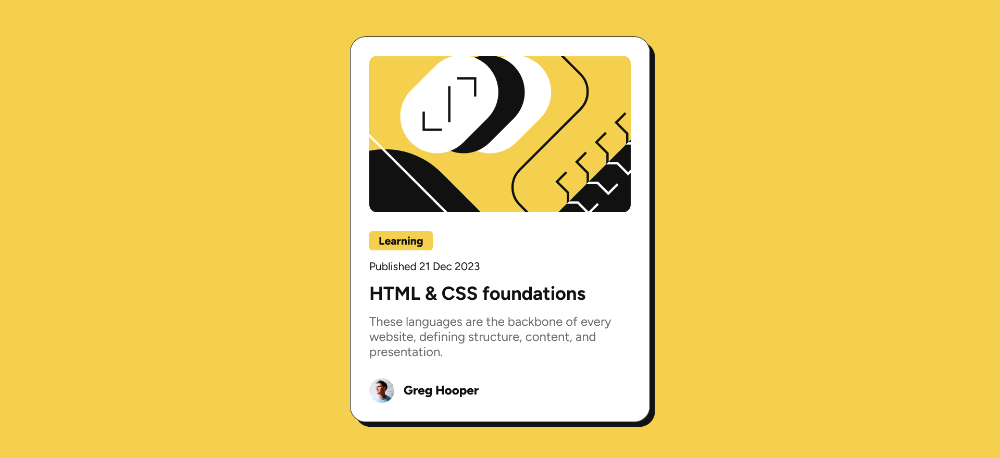

# Frontend Mentor - Blog preview card solution

This is a solution to the [Blog preview card challenge on Frontend Mentor](https://www.frontendmentor.io/challenges/blog-preview-card-ckPaj01IcS). Frontend Mentor challenges help you improve your coding skills by building realistic projects. 

## Table of contents

- [Overview](#overview)
  - [The challenge](#the-challenge)
  - [Screenshot](#screenshot)
  - [Links](#links)
- [My process](#my-process)
  - [Built with](#built-with)
  - [What I learned](#what-i-learned)
  - [Continued development](#continued-development)
- [Author](#author)

## Overview

### The challenge

Users should be able to:

- See hover and focus states for all interactive elements on the page

### Screenshot

### Links

- Solution URL: [Add solution URL here](https://github.com/vishpant76/blog-preview-card)
- Live Site URL: [Add live site URL here](https://vishpant76.github.io/blog-preview-card/)

## My process

### Built with

- Semantic HTML5 markup
- CSS Flexbox

### What I learned

- Using `clamp` to dynamically adjust the font-size on varying screen sizes.

- Got more practice with using CSS variables.

- Using Figma to inspect the provided design files to make more concrete decisions on the various CSS properties instead of relying on guesswork.

### Continued development

- Still not very comfortable with transitions and box shadows. Looking forward to more such exercises to practice applying subtle and smooth transitions.

- Flexbox concepts are still shaky. Need more practice on letting an element shrink to content instead of forcibly trying to control its width. A good example is setting the display type of the flex item rather than its width, to change its size behavior - something I struggled to think of in this project.

## Author

- Frontend Mentor - [@vishpant76](https://www.frontendmentor.io/profile/vishpant76)

